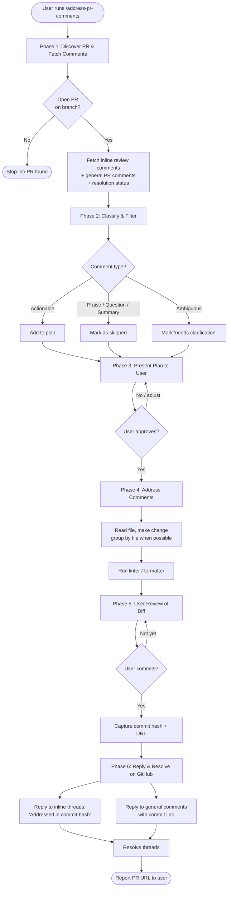

# address-pr-comments

A Claude Code plugin that helps systematically review, plan, address, and resolve unresolved pull request comments on the current branch.

## What it does

The `address-pr-comments` skill walks through the open PR for the current branch, fetches inline review comments and general PR comments (from human reviewers and automated tools like CodeRabbit or Claude Code Review), filters out non-actionable items (praise, questions, summaries), and produces a plan. After you approve the plan, it makes the code changes, lets you commit, then replies to each comment on GitHub with the commit reference and resolves the thread.

## Installation

Install via the marketplace:

```bash
/plugin marketplace add donnfelker/donnfelker-plugin-marketplace
/plugin install address-pr-comments
```

## Usage

Invoke the skill with:

```
/address-pr-comments
```

Run this from a branch that has an open PR. The skill will discover the PR automatically via `gh pr view`.

## Prerequisites

- [`gh` CLI](https://cli.github.com/) installed and authenticated
- An open pull request on the current branch
- Permissions to comment on and resolve threads in the PR

## Flow



## Phases

1. **Discover** — find the PR for the current branch and fetch all comments
2. **Classify** — separate actionable comments from praise/questions/summaries
3. **Plan** — present a numbered plan with file, reviewer, comment, proposed fix
4. **Address** — apply the approved changes, run linters
5. **Review** — let the user review the diff and commit on their own terms
6. **Reply & Resolve** — post `Addressed in <commit>` replies and resolve threads

## Notes

- The skill never commits automatically — you decide when and how.
- Ambiguous comments are surfaced in the plan as `needs clarification` rather than silently skipped.
- Automated bot summaries (e.g., CodeRabbit walkthroughs) are treated as informational, not actionable.

## License

MIT
